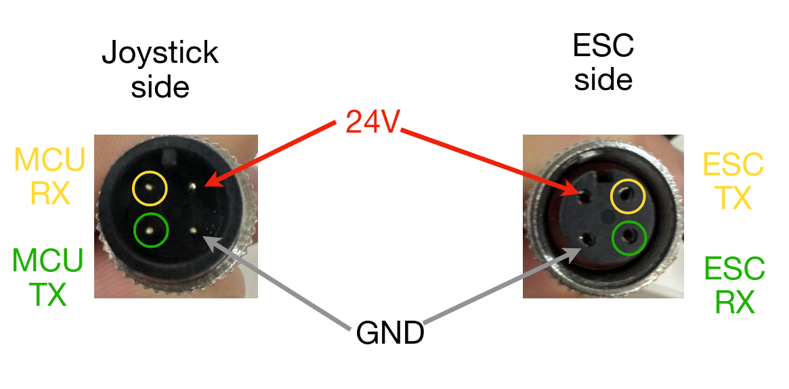
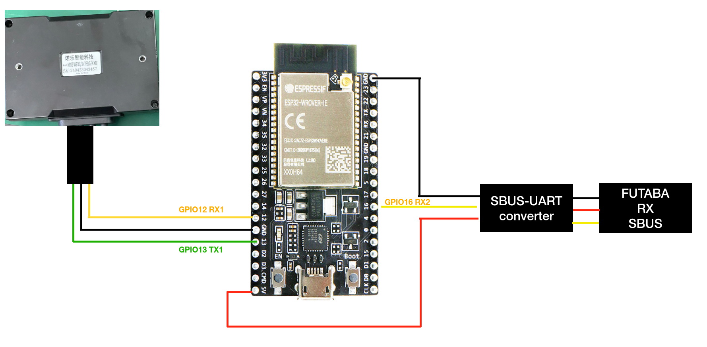

# ATCart ESC "MN2 WSDC/3+7F&G-X XD"

A simple hack on UART communication of ESC **MN2 WSDC/3+7F&G-X XD** model. Please check on [sbus_driven](./sbus_driven/sbus_driven.ino) sketch for more detail.

This code is programmed for ESP32, but it could be adopted to any microcontroller or computer with UART connection.

## Connection

original connector 

connection diagram for ESP32

